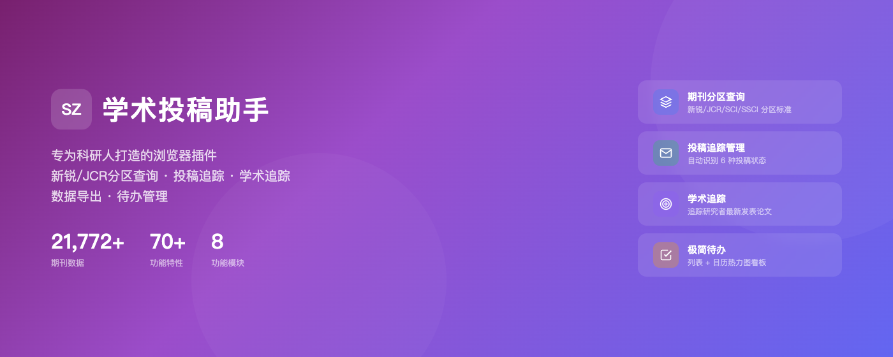
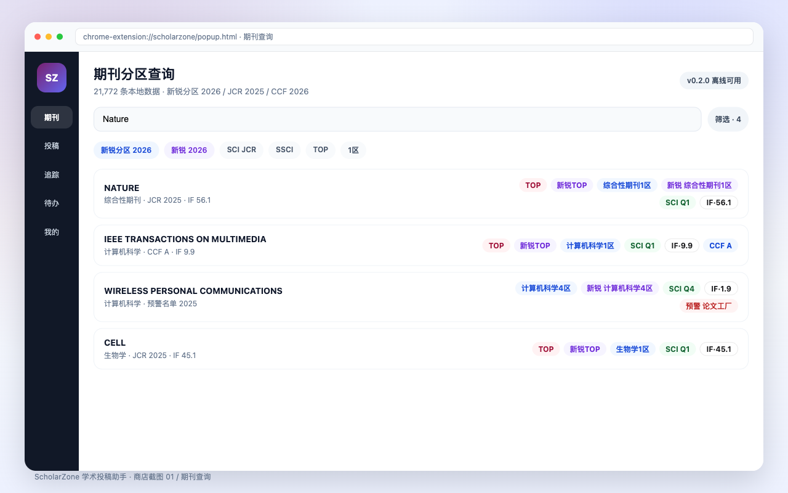
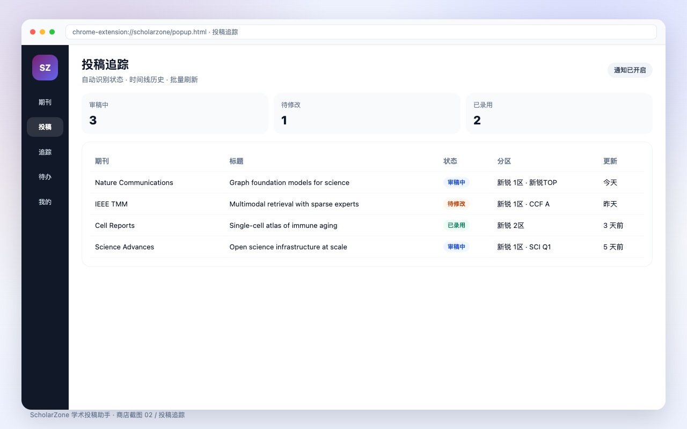
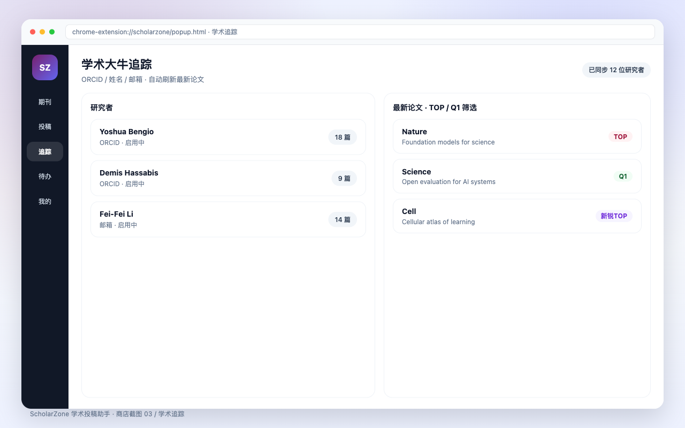
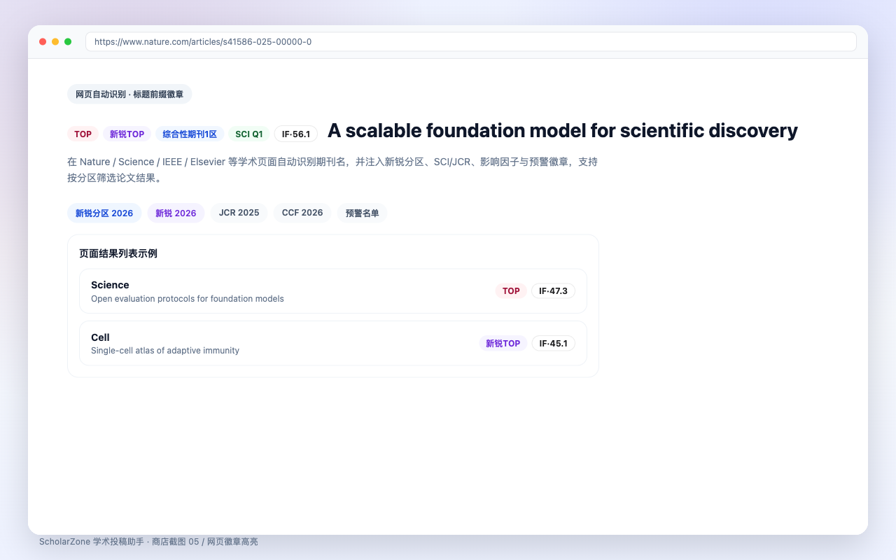

# ScholarZone 学术投稿助手

**[中文](README.zh-CN.md) | English**

ScholarZone is an academic companion for researchers, available as a Chrome
extension. It displays journal ranking badges — partitions, impact factors,
CCF grades — directly on Google Scholar, PubMed, arXiv, CNKI and journal
websites, tracks manuscript submissions automatically, and follows the
publications of researchers you care about.

Two journal databases are bundled and work fully offline, no account needed:

- **Xinrui Journal Partition Table 2026** (新锐期刊分区表) — the successor
  standard after the CAS partition table was permanently discontinued
- **JCR 2025** — impact factors and Web of Science quartiles

> The Chinese Academy of Sciences stopped publishing its journal partition
> table in 2026 (the 2025 edition was the last). ScholarZone was the first
> extension to adopt the Xinrui 2026 table as its only partition standard.

## Screenshots

| Journal search | Submission tracking |
|---|---|
|  |  |

| Researcher tracking | On-page badges |
|---|---|
|  |  |

## Features

- 🏷️ **Journal rank badges on every paper page** — Xinrui 2026 partitions,
  Top marks, warning flags, JCR IF / 5-year IF, JCI, CCF A/B/C, SSCI, EI,
  ABS/AJG, FT50, UTD24
- 🔍 **Offline journal search** — 21,772 journals with fuzzy & abbreviation
  matching (*JACS*, *Adv Mater* …)
- 🧹 **Result filtering** — hide / mask / highlight papers by rank zone
- 📮 **Submission tracking** — auto-detects manuscript status on submission
  portals, with timeline & notifications
- 👤 **Researcher tracking** — follow scholars, sync new papers
- ✅ **To-dos with heat-map board**
- 📊 **Excel export** with rank filtering

## Install

**Option A — Chrome Web Store**:
<https://chromewebstore.google.com/detail/ficebgfabfegcikljhlmhabpbficnenp>

**Option B — GitHub Releases**:
1. Download `scholarzone-extension-store.zip` from the
   [latest Release](https://github.com/MicTx/scholarzone/releases)
2. Unzip it
3. Open `chrome://extensions`, enable **Developer mode**, click
   **Load unpacked** and select the unzipped folder

## Data & attribution

| Dataset | Edition | Publisher |
|---------|---------|-----------|
| 新锐期刊分区表 | 2026 | 新锐学术 |
| Journal Citation Reports | 2025 | Clarivate |
| CCF 推荐国际学术会议和期刊目录 | 2026 | CCF |
| 国际期刊预警名单 | 2025 (final) | 中科院文献情报中心 |

Journal data is for personal academic use only — see [NOTICE.md](NOTICE.md).

## Privacy

ScholarZone works offline by default. Journal lookups never leave your
browser. Privacy policy: <https://scholarzone.tvt.wiki/privacy-policy.html>

## License

The released builds are licensed under the
[PolyForm Noncommercial License 1.0.0](LICENSE). Commercial use requires
separate written authorization from the project owner.

## Links

- Homepage: <https://scholarzone.tvt.wiki>
- Support: tvtservices@163.com
